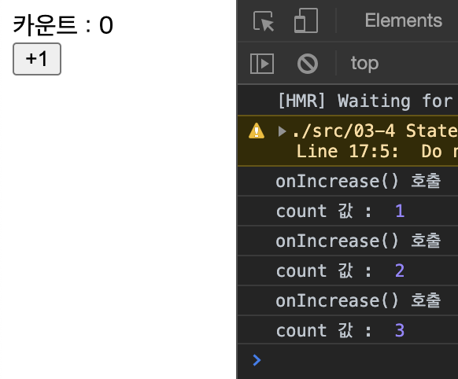
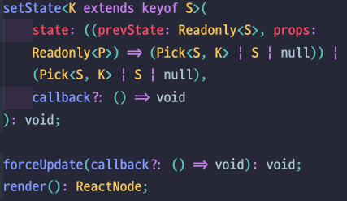

# state란

State는 `값을 저장하거나 변경할 수 있는 객체` 이다

# state로 상태 관리 해보기.

```javascript
import React, { Component } from "react";

class StateExample extends Component {
  constructor(props) {
    super(props);
    this.state = {
      count: 0
    };
  }

  onIncrease = () => {
    console.log("onIncrease() 호출");
    //state 변경
    this.setState({
      count: this.state.count + 1
    });
    //this.state.count의 값은 현재 0 입니다.
    console.log("count 값 : ", this.state.count);
    //이후 호출될 render() 함수에서의 this.state.count의 값은 setState() 함수가 호출된 이후의 결과값 입니다.
  };

  render() {
    return (
      <div>
        {/* state 데이터는 this.state로 접근 가능합니다. */}
        <div>카운트 : {this.state.count}</div>
        <button onClick={this.onIncrease}>+1</button>
      </div>
    );
  }
}

export default StateExample;
```

[위 예제](./StateExample.js)는 state로 count 값을 관리하고 버튼을 클릭했을때 setState()를 호출하여 count값을 변경하는 예제 입니다.

> **state를 사용할 때 주의할 점**  
> _1.생성자(constructor)에서 반드시 초기화해야 합니다. 마땅한 초기값이 없으면 빈객체라도 넣어야 합니다.(`this.state = {}`)  
> [2.state값을 변경할 때는 setState() 함수(상태 관리 함수)를 반드시 사용해야 합니다.](<##-setState()-함수를-사용하지-않을때>)  
> 3.setState() 함수는 비동기로 처리되며, setState() 코드 이후로 연결된 함수들의 실행이 완료된 시점에 화면 동기화 과정을 거칩니다._

## setState() 함수의 함수형 업데이트 방법

위 예제에서 우린 setState() 함수에 새로운 객체를 만들어 state값을 변경 시켰습니다.

## setState() 함수를 사용하지 않을때

setState() 함수를 사용하지않고 직접 state 값을 바꾸면 어떻게 될까?

```javascript
onIncrease = () => {
  this.state.count += 1;
};
```

<center></center>
<center>[state를 직접 변경했을때.jpg]</center>

위 결과를 보면 `state`값은 바뀌었지만 화면은 여전히 0을 보여주고 있습니다. 그 이유는 리액트가 컴포넌트의 `state`가 바뀌었다는걸 모르기 때문입니다.
그렇다면 `setState()`함수를 사용했을때는 `state`가 바뀐다는걸 아는것인데 어떻게 구현되었는지 한번 `setState()`함수의 구현부를 살펴보겠습니다.

<center></center>
<center>[setState() 함수의 구현부]</center>

`setState()` 함수안에 `forceUpdate()`와`render()` 함수가 보이시나요?

`render()`함수는 컴포넌트를 렌더링해주는 함수이며 `forceUpdate()`함수는 `render()`함수를 호출해주는 함수입니다.

그렇다면 state를 직접 변경하고 `forceUpdate()`를 호출해 렌더링시켜 보면 `setState()` 함수로 변경한것과 동일한 결과를 얻을 수 있을 것 입니다. 단, 이 방법은 리액트 성능에 제약이 있으므로 매번 새롭게 화면을 출력해야 되는 경우가 아니라면 가급적 사용하지 않기를 권장합니다.

```javascript
onIncrease = () => {
  this.state.count += 1;
  this.forceUpdate(); //컴포넌트를 렌더링 시킵니다.
};
```

> 결론 state를 직접 변경하면 state가 변했는지 모른다.
