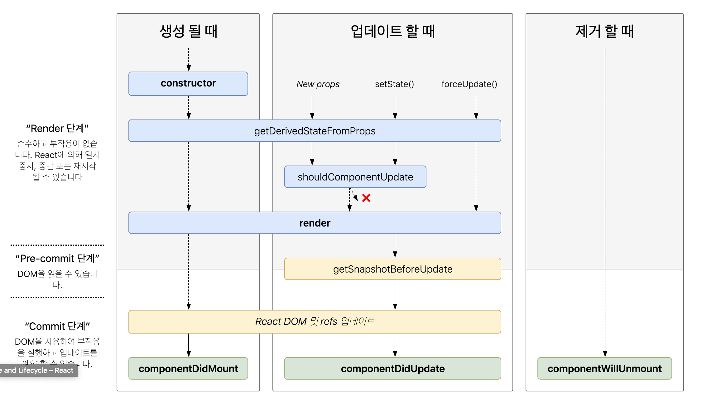

# Lifecycle이란

컴포넌트가 생성되고 소멸되기 까지의 과정으로 각 생명주기 마다 함수를 호출하는데 특정 시점에 원하는 동작을 실행할수 있도록 도와주는 함수입니다.



[사이트 참조](https://projects.wojtekmaj.pl/react-lifecycle-methods-diagram/)

처음 보는 메서드들와 긴 이름때문에 겁먹을수도 지만 쉽게 풀어쓰자면

생성 될 때(Mounting) - `constructor()` - `getDerivedStateFromProps()` - `render()` - `componentDidMount()` 순서대로 4개의 method가 호출되고

업데이트 될때(Updating) - `getDerivedStateFromProps()` - `shouldComponentUpdate()` - `render()` - `getSnapshotBeforeUpdate()` - `componentDidUpdate()` 순서대로 5가지

마지막으로 제거 (Unmounting) 될땐 `conponentWillUpdate()`method 하나만 호출된다.

각 함수의 기능은 아래 예제에서 다루겠습니다.

```javascript
import React, { Component } from "react";

class Counter extends Component {
  /* 
  getDerivedStateFromProps() 함수는 
  상위 컴포넌트에서 전달 받은 props로 state값을 연동할 때 주로 사용되며
  반환값으로 state를 변경합니다.
  */
  static getDerivedStateFromProps(nextProps, prevState) {
    console.log("getDerivedStateFromProps()");
    // console.log(nextProps, prevState);
    if (nextProps.username !== prevState.username) {
      return { username: nextProps.username };
    } else {
      return null;
    }
  }
  constructor(props) {
    super(props);
    this.state = {
      username: "",
      count: 0
    };
    console.log("constructor()");
  }

  componentDidMount() {
    console.log("componentDidMount()");
    // 해당 컴포넌트가 브라우져에 보여지는 상태. 따라서 DOM에 접근가능
    console.log(document.querySelector(".count"));
  }

  shouldComponentUpdate(nextProps, nextState) {
    //주로 성능 최적화할때 쓰이는 메소드. 불필요한 렌더링을 막기위해 쓴다.
    // true를 반환하면 렌더링하고 false를 반환하면 렌더링을 하지 않는다.
    console.log("shouldComponentUpdate()");
    if (nextState !== this.state) {
      return true;
    }
    return false;
  }

  getSnapshotBeforeUpdate(prevProps, prevState) {
    // DOM 업데이트가 일어나기 직전의 시점에 호출되는 함수.
    //이 메서드의 리턴값은 componentDidUpdate에서 함수의 세번째 인자 snapshot로 조회 할수 있다.
    console.log("getSnapshotBeforeUpdate()");
    console.log(prevProps, prevState);
    //업데이트가 되기전 상태값과 속성값을 리턴할수 있다.
    if (prevProps.username !== this.props.username) {
      return { username: prevProps.username };
    }
    return { username: prevProps.username };
  }

  componentDidUpdate(prevProps, prevState, snapshot) {
    // 여기서 snapshot은 getSnapshotBeforeUpdate() 의 리턴값이다.
    console.log("componentDidUpdate()");
    console.log("업데이트 되기전 username: ", snapshot);
  }
  componentWillUnmount() {
    console.log("componentWillUnmount()");
  }
  onIncrease = () => {
    this.setState(prevState => (prevState.count += 1));
  };

  render() {
    console.log("render()");
    return (
      <>
        <div className="count">
          {this.state.username}의 count : {this.state.count}
        </div>
        <button onClick={this.onIncrease}>+1</button>
        <button onClick={() => this.forceUpdate()}>forceUpdate</button>
      </>
    );
  }
}

class LifecycleExample extends Component {
  constructor(props) {
    super(props);
    this.state = {
      username: "koo",
      visible: true
    };
  }
  onToggle = () => {
    this.setState({
      visible: !this.state.visible
    });
  };
  onChangeProps = () => {
    this.state.username === "koo"
      ? this.setState({ username: "park" })
      : this.setState({ username: "koo" });
  };
  onChange = e => {
    const { value, name } = e.target;
    console.log(value, name);
    this.setState({
      [name]: value
    });
  };
  render() {
    return (
      <>
        {this.state.visible && <Counter username={this.state.username} />}
        <br />
        <button onClick={this.onChangeProps}>changProps</button>
        <br />
        <button onClick={this.onToggle}>show & hide Toggle</button>
        <br />
        <button
          onClick={() =>
            this.setState({
              ...this.state
            })
          }
        >
          setState
        </button>
      </>
    );
  }
}

export default LifecycleExample;
```

[예제-모든 Lifecycle Method 구현해보기(작업중...)](./LifecycleExample.js)

- Toggle 버튼으로 Mounting 과정에서 실행되는 method들과 Unmounting 까지 실행되는 method를 확인할수 있습니다.
- forceUpdate 버튼으로 `forceUpdate()`함수를 실행시켜 `render(), getSnapshotBeforUpdate(), componentDidUpdate()`method 를 실행시킬수 있습니다. (forceUpdate) **_!forceUpdate는 `shouldComponentUpdate()` 함수를 호출하지 않습니다._**
- changeProps 버튼으로 props값을 바꿔서 넣어줄 수 있습니다. (New Props) 또한 `getSnapshotBeforUpdate()`함수에서 반환하는값을 `componentDidUpdate()`에서 조회하는것을 확인 할 수 있습니다.
- +1 버튼으로 state를 변경해줄수 있습니다. (setState)
- setState 버튼은 아무것도 바꾸지않는 빈 setState() 함수입니다. 불필요한 렌더링을 발생시켜 `shouldComponentUpdate()`함수로직을 실행시킵니다.
